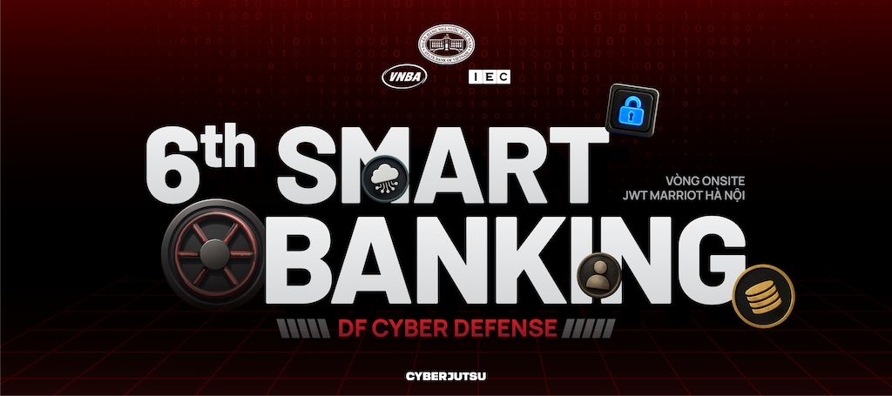
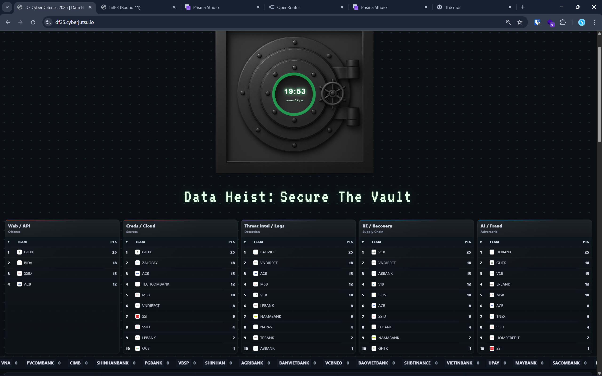

# Giới thiệu về Diễn tập DF Cyber Defense 2025 

Chào mừng bạn đến với kho tư liệu chính thức từ DF Cyber Defense 2025 - sự kiện diễn tập an ninh mạng quy mô lớn hàng đầu trong lĩnh vực tài chính - ngân hàng. Cuộc diễn tập năm nay thu hút sự tham gia của hơn 200 kỹ sư từ hơn 50 tổ chức, bao gồm các ngân hàng, tổ chức tài chính, công ty công nghệ tài chính (Fintech) và các chuyên gia hàng đầu trong ngành, cùng hợp lực để bảo vệ dữ liệu trước những mối đe dọa ngày càng tinh vi.

🔗 Thông tin chi tiết sự kiện: https://bankingsummit.vn/2025/df-cyber-denfense

## Ban Tổ Chức Chính:

- Cục Công nghệ thông tin, Ngân hàng Nhà nước Việt Nam
- Hiệp Hội Ngân hàng Việt Nam
- Tập đoàn IEC Group

## Đơn vị tài trợ và chuyên môn
- TrendMicro Vietnam
- CyberJutsu Academy: Chịu trách nhiệm xây dựng thử thách kỹ thuật, quản lý hạ tầng thi đấu, đảm bảo tính thực tế và bảo mật chuyên môn cho toàn bộ diễn tập

# Tổng hợp writeups và challenges source code

Qua các thử thách thực tế, CyberJutsu mong muốn truyền tải và phản ánh chân thật nhất bối cảnh an ninh mạng hiện tại thông qua các chủ đề: Web & API Security, Cloud & Secrets Management, Threat Intelligence & Log Hunting, Reversing & Recovery, AI Security & Fraud Prevention.

Hy vọng những tài liệu này sẽ hỗ trợ hiệu quả cho các đội thi, chuyên gia, cộng đồng bảo mật, góp phần nâng cao năng lực phản ứng nhanh trước các sự cố an ninh, củng cố hơn nữa sức mạnh của cộng đồng an ninh mạng tại Việt Nam.

> 
> "Chiếm đỉnh đã khó, giữ đỉnh càng khó hơn"

## Jeopardy Challenges

### Vòng Online

| Challenge Name                              | Author         | Category      | Difficulty | Writeup                                   | Live challenges                                       |
| ------------------------------------------- | -------------- | ------------- | ---------- | ----------------------------------------- | ----------------------------------------------------- |
| [Gadgets Store](online/1-web-api)           | monkeontheroof | Web-Api       | Hard       | [📄](online/1-web-api/solution)           | [🔗 gadgets-store.df25.cyberjutsu-lab.tech](https://gadgets-store.df25.cyberjutsu-lab.tech/) |
| [Time Is Gold](online/2-credentials-cloud)  | CentralCee++   | Creds / Cloud | Hard       | [📄](online/2-credentials-cloud/solution) |                                                       |
| [R U Hunter v2](online/3-dfir-threat)       | supadumb       | DFIR          | Medium     | [📄](online/3-dfir-threat/solution)       |                                                       |
| [Pixel Blackout](online/4-reverse-recovery) | CentralCee++   | RE / Reverse  | Medium     | [📄](online/4-reverse-recovery/solution)  |                                                       |
| [FinovaVision](online/5-ai-fraud)           | Droplet        | AI            | Medium     | [📄](online/5-ai-fraud/solution)          | [🔗 finova-vision.df25.cyberjutsu-lab.tech](https://finova-vision.df25.cyberjutsu-lab.tech/) |

### Vòng Onsite

| Challenge Name                                      | Author         | Category     | Difficulty | Writeup                                  | Link                                                     |
| --------------------------------------------------- | -------------- | ------------ | ---------- | ---------------------------------------- | -------------------------------------------------------- |
| [FinovaBank Statement Viewer](onsite/1-web-api)     | monkeontheroof | Web / API    | Medium     | [📄](onsite/1-web-api/solution)          | [🔗 finova-statement.df25.cyberjutsu-lab.tech](https://finova-statement.df25.cyberjutsu-lab.tech/) |
| [TempPad](onsite/2-web-api)                         | Droplet        | Web          | Medium     | [📄](onsite/2-web-api/solution)          | [🔗 temppad.df25.cyberjutsu-lab.tech](https://temppad.df25.cyberjutsu-lab.tech/)          |
| [Pixel Blackout Revenge](onsite/4-reverse-recovery) | CentralCee++   | RE / Reverse | Hard       | [📄](onsite/4-reverse-recovery/solution) |                                                          |
| [Next-gen WAiF](onsite/5-ai-fraud)                  | CentralCee++   | AI / Fraud   | Medium     | [📄](onsite/5-ai-fraud/solution)         | [🔗 nextgen-walf.df25.cyberjutsu-lab.tech](https://nextgen-walf.df25.cyberjutsu-lab.tech/)     |
