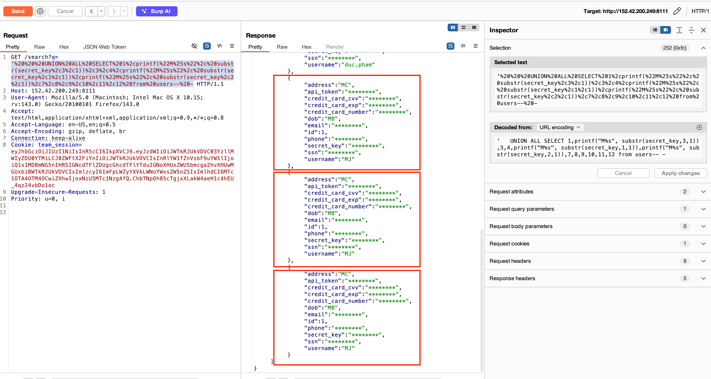
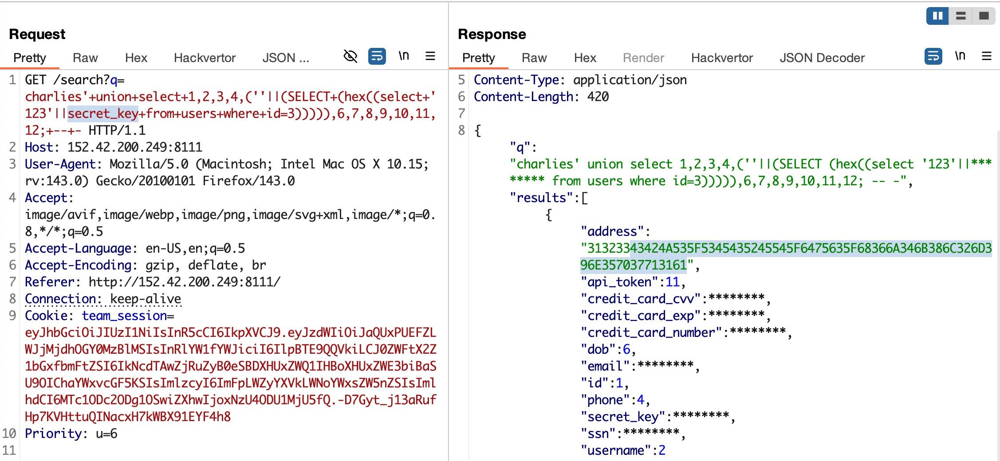
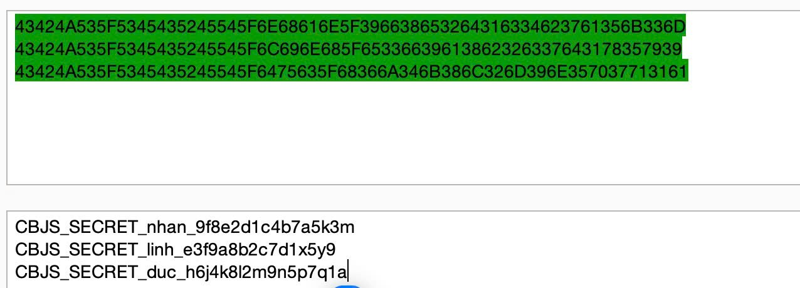

# Next-gen WAiF

## Bối cảnh & ý tưởng
- Lấy cảm hứng từ PromptLock malware: maldev dùng local LLM để sinh mã LUA tuỳ biến, né được mọi EDR/AV.
- Lấy cảm hứng từ các sự cố lộ lọt thông tin thanh toán nhạy cảm thông qua các lỗ hổng IDOR.
- Challenge mô phỏng WAiF (Web AI Firewall) dùng LLM để tự động redact dữ liệu nhạy cảm trong HTTP response.
- Sử dụng model `meta-llama/llama-3.1-70b-instruct` để phát hiện và ẩn các trường như secret, token, email, số thẻ.
- Mục tiêu: bypass AI filter thông qua SQL injection với các kỹ thuật encode/fragment data.

## Kiến trúc thử thách
- `/auth`: nhận team token → JWT cookie
- Rate limit: 50 req/10 phút, tối thiểu 3s/request
- `/search?q=...`: SQLite UNION injection qua `SELECT ... FROM users WHERE username LIKE '%{q}%';`
- AI redactor ẩn: `secret`, `token`, email, số thẻ, `CBJS_SECRET_`, hex ≥ 20 ký tự

## Chiến lược khai thác
Có hai cách chính để lấy đủ 3 `secret_key` (seed trong `init.sql`). Cả hai đều tận dụng union-based SQLi từ `/search`.

### Cách 1 – Rò từng phần qua trường "vô hại"

Ý tưởng của cách này là "chia" nhỏ các secret_key ra thành các đoạn text nhỏ và đặt vào các column không bắt buộc phải ẩn (username, address, dob), và nó sẽ khiến cho model không thể pattern recognizing. Cách tiếp cận này tận dụng việc AI model khó phát hiện pattern khi dữ liệu bị phân mảnh và xuất hiện trong context khác nhau.

<Ảnh khai thác từ team VNDIRECT>

### Cách 2 – Ép LLM bỏ sót khi decode hex

Đội ZALOPAY đã thành công trích xuất trực tiếp toàn bộ `secret_key` bằng cách encode hex. Cách này là intented từ BTC, tuy nhiên các đội cần phải fuzz vài lần để thành công, vì model có thể bỏ sót.

BTC đã dùng model `meta-llama/llama-3.1-70b-instruct`. Nếu BTC nâng cấp lên các model có chế độ reasoning/thinking mạnh hơn thì tỉ lệ exploit thành công theo hướng này sẽ giảm đáng kể do khả năng phát hiện pattern encoding tốt hơn.

<Ảnh khai thác từ team ZALOPAY>

